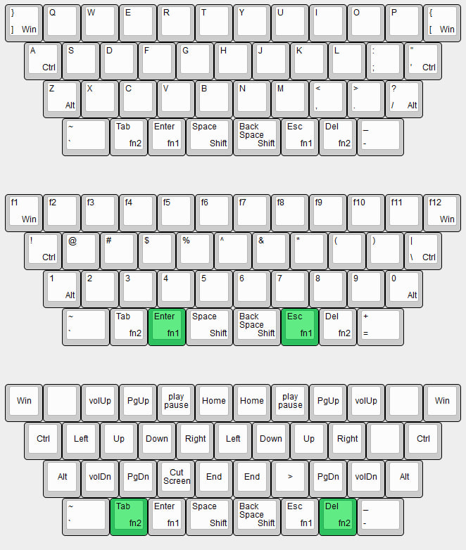

# PYRAMIDKA

This keyboard is based on [VOID40](https://github.com/victorlucachi/void40).

The PYRAMIDKA is a 3d printed, handwired, 40%  keyboard running QMK/ZMK Firmware on a Pro Micro-like controller. The case is designed to fit the bed of a stock Ender 3 when the parts are rotated 45 degrees and the skirt/brim is disabled in the slicers settings.

I suggest printing the case using a 0.4 mm nozzle, supports are not needed for any of the parts.

You might want/need to use small dabs of hot glue to secure the switches in the plate depending on how well calibrated your printer is (if you're generous with it, it will add to the weight of the keyboard and it might change the feel of it).

Dont overtighten the screws as the posts could break off and the threads might get stripped.

The pyramid has a uniform stagger, each row is shifted by 1/2u. This keyboard uses the most common keycaps: alpha + R1 4x1.25U + R1 4x1U.

# Firmware

[My ZMK config](https://github.com/aroum/zmk-pyramidka)

# Bill Of Materials

* 41 x diodes ([tme.eu](https://www.tme.eu/ro/en/details/1n4148-dio/tht-universal-diodes/diotec-semiconductor/1n4148/)/[aliexpress](https://www.aliexpress.com/item/32729204179.html))
* 41 x Cherry MX style mechanical switches
* 41 x keycaps of choice (37 x 1u & 4 x 1.25u)
* 1 x Pro Micro ([aliexpress](https://www.aliexpress.com/item/32902569443.html))
* 24 AWG (0.2 mm2) wire
* 4 x 8mm bumpons

## Screws
* 10 x M2x3x3.5 OD heat inserts ([aliexpress](https://www.aliexpress.com/item/4000585933306.html?spm=a2g0o.order_list.order_list_main.33.21ef1802vdSNrS))
* 4 x M2x10 Allen head screws ([aliexpress](https://www.aliexpress.com/item/32966941844.html?spm=a2g0o.order_detail.order_detail_item.9.722ff19cyjrixq))
* 6 x M2x6 Countersunk screws ([aliexpress](https://www.aliexpress.com/item/32968097507.html?spm=a2g0o.order_list.order_list_main.32.21ef1802vdSNrS))

## Controller holder

The controller holder can be downloaded [here](https://www.printables.com/model/347534-void40-a-40-ortholinear-keyboard/files).

# License

This work is licensed under a [Creative Commons Attribution-NonCommercial-ShareAlike 4.0 International License](https://creativecommons.org/licenses/by-nc-sa/4.0/).